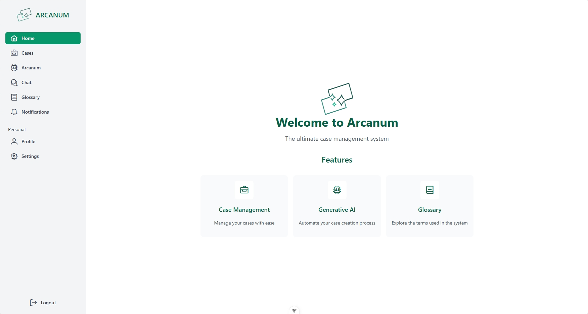
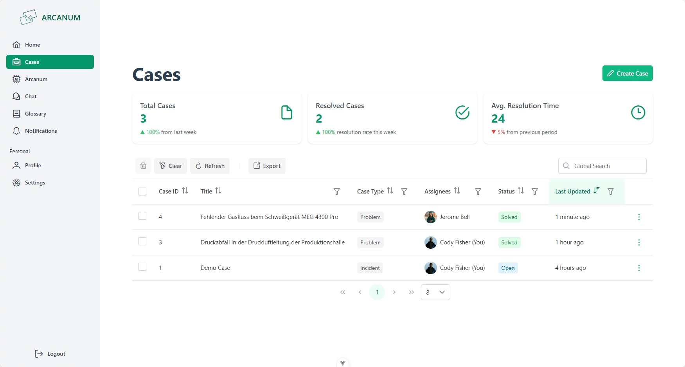
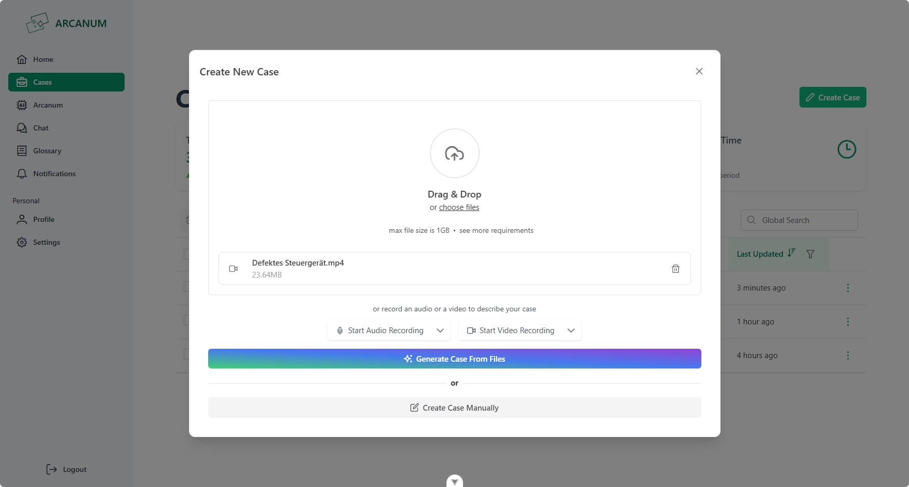
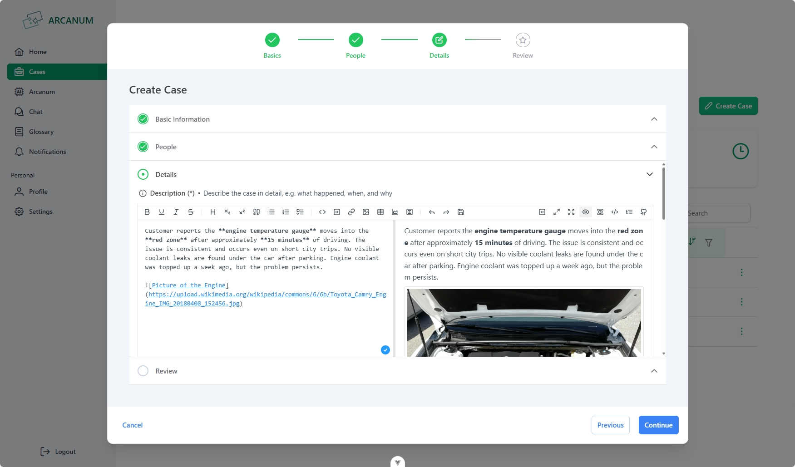
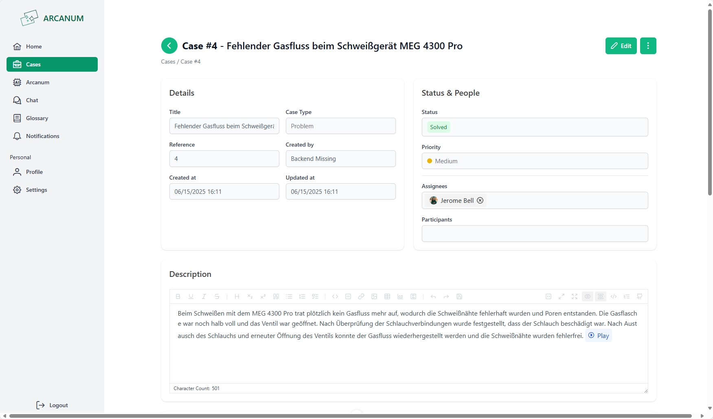
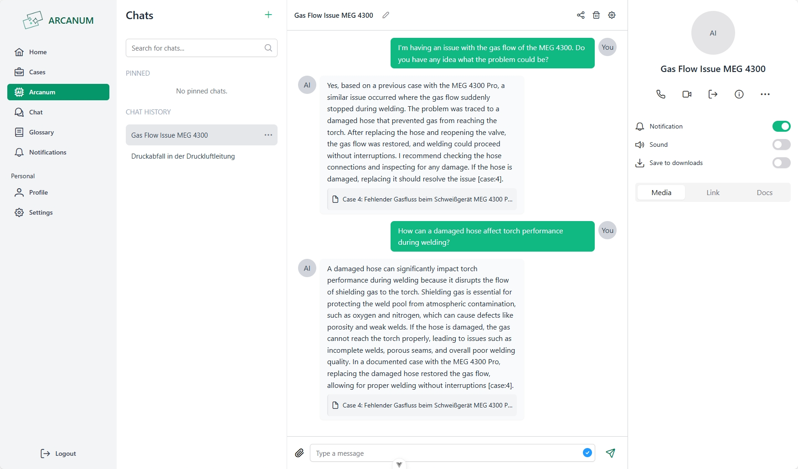
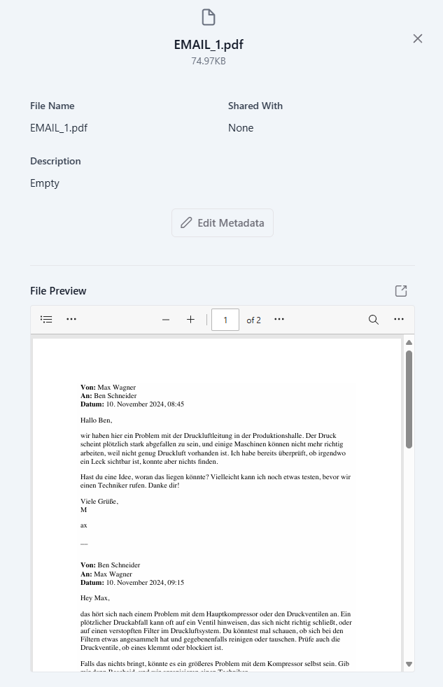
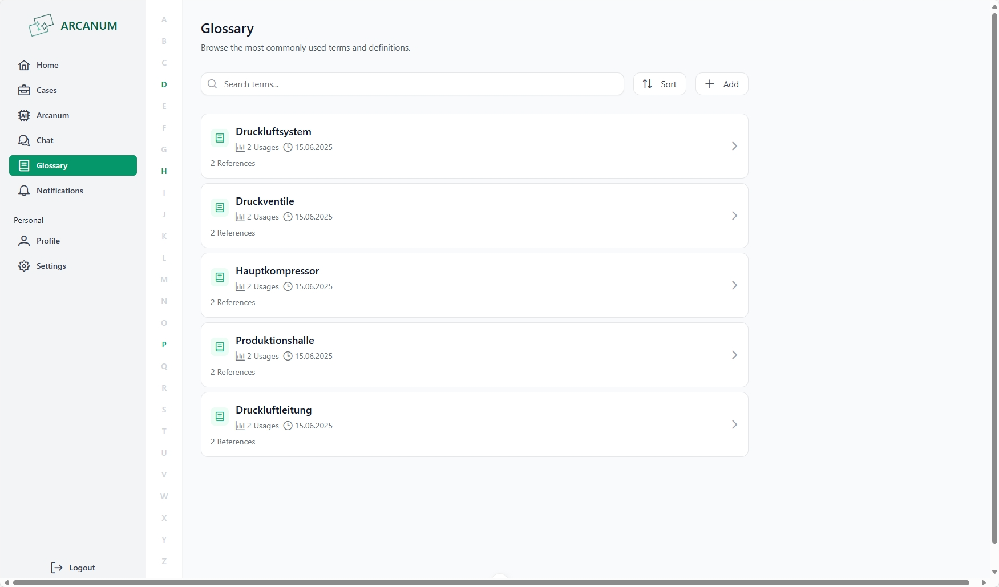

# oculavis ARCANUM – Feature Showcase

This showcase highlights the key user-facing features of the **oculavis ARCANUM** web application, demonstrating its capabilities through screenshots and descriptions.

---

## Home View

The entry point of the application, where users are greeted with an intuitive dashboard. Navigation to major features such as case management, chat, and glossary is easily accessible.

---

## Case List View

Displays an overview of all created cases. Includes filtering, searching, and sorting functionalities to easily locate relevant cases.

---

## Case Generation View (AI-Assisted)

Leverages the power of AI to help users generate new cases from unstructured input. Supports documents, media, and free-text inputs.

---

## Case Creation View (Manual)

An interface for creating new cases. Users can input structured metadata and upload files (text, images, videos) to enrich their cases.

---

## Case Detail View

Provides a detailed look into individual cases, including metadata, associated documents, files, and associated glossary terms.

---

## AI Chat View

An AI-powered chatbot built using LangChain and OpenAI. Supports natural language interaction, allowing users to ask questions about documents, cases, or general knowledge.

---

## File Preview View

Enables inline previews of uploaded files including PDFs, images, and more. Offers a seamless experience when browsing documents related to cases.

---

## Glossary View

A central place for managing and referencing domain-specific terminology. Terms are searchable and editable for ease of use.

---

## That's a Wrap!

This concludes the visual tour of the oculavis ARCANUM application. These views reflect the combined efforts of the frontend, backend, and LLM teams to deliver a seamless and intelligent case management experience.

---

*For technical details, setup instructions, and contributors, please refer to the [README.md](/README.md).*
